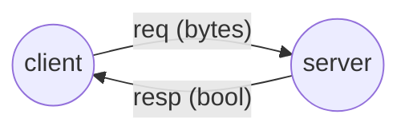

# ROS2 bytes data transmit

## Introduction

Transmit bytes data between ROS 2 nodes using service/client.

> This package is built by mixing cpp and python, please refer to [link](https://roboticsbackend.com/ros2-package-for-both-python-and-cpp-nodes/#Setup_your_ROS2_Cpp_and_Python_package)



## Getting Started

### 1. Clone the repository in your ROS2 workspace
```bash
cd ~/<your_ws>/src
git clone https://github.com/khinggan/ros2_bytes_transmit.git
```
### 2. Build 
```
cd ~/<your_ws>/
colcon build --packages-select ros2_bytes_transmit --symlink-install
```

> !TODO, configure `absolute_path` with your project path; need to be modified to relative path later. (line 8 in `src/ros2_bytes_transmit/client.py`)

### 3. Run server and client
> Please remember to add executable permission to the python files
> `chmod +x server.py client.py`


```bash
# Terminal 1
source install/setup.bash
ros2 run ros2_bytes_transmit server.py
```

```bash
# Terminal 2
source install/setup.bash
ros2 run ros2_bytes_transmit client.py
```

## Constract by yourself
Create package `ros2_bytes_transmit`
```bash
cd <your_workspace>/src
ros2 pkg create ros2_bytes_transmit --build-type ament_cmake --dependencies std_msgs rclcpp rclpy
```

Create python packages
```bash
cd <your_workspace>/src/ros2_bytes_transmit/
mkdir ros2_bytes_transmit
touch ros2_bytes_transmit/__init__.py
mkdir scripts
touch scripts/server.py scripts/client.py
```
> make sure add `touch scripts/py_node.py` at the top of the python files (server.py and client.py)

Chmod of python files
```bash
chmod +x server.py client.py
```
Paste the code into server.py and client.py

create custom service
```bash
mkdir srv
touch Ros2BytesTransmit.srv
# paste the service code
```
Configure `CMakeLists.txt` and `package.xml`

CMakeLists.txt
```CMake
...
# find dependencies
find_package(ament_cmake REQUIRED)
find_package(ament_cmake_python REQUIRED)
find_package(std_msgs REQUIRED)
find_package(rclcpp REQUIRED)
find_package(rclpy REQUIRED)

# Install CPP modules
find_package(geometry_msgs REQUIRED)
find_package(rosidl_default_generators REQUIRED)

rosidl_generate_interfaces(${PROJECT_NAME}
  "srv/Ros2BytesTransmit.srv"
  DEPENDENCIES geometry_msgs # Add packages that above messages depend on
)

# Install Python modules
ament_python_install_package(${PROJECT_NAME})
# Install Python executables
install(PROGRAMS
  scripts/server.py
  scripts/client.py
  DESTINATION lib/${PROJECT_NAME}
)
...
```
package.xml
```xml
  ...
  <buildtool_depend>ament_cmake</buildtool_depend>
  <buildtool_depend>ament_cmake_python</buildtool_depend>

  <depend>std_msgs</depend>
  <depend>rclcpp</depend>
  <depend>rclpy</depend>

  <depend>geometry_msgs</depend>
  <buildtool_depend>rosidl_default_generators</buildtool_depend>
  <exec_depend>rosidl_default_runtime</exec_depend>
  <member_of_group>rosidl_interface_packages</member_of_group>
  ...
```

